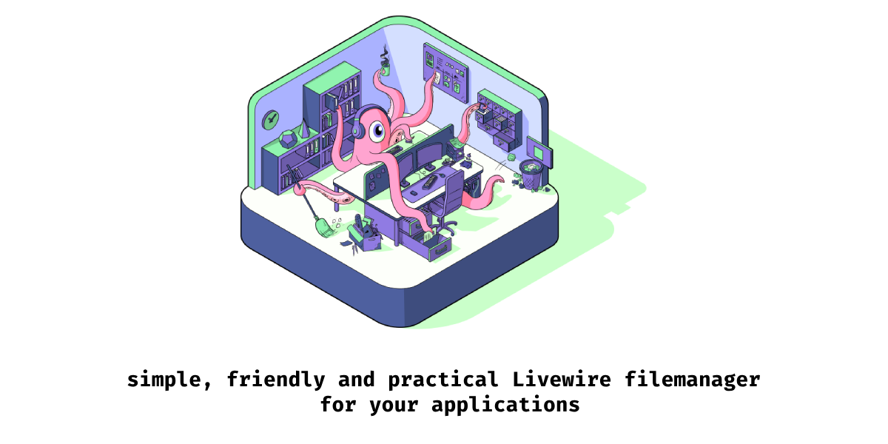
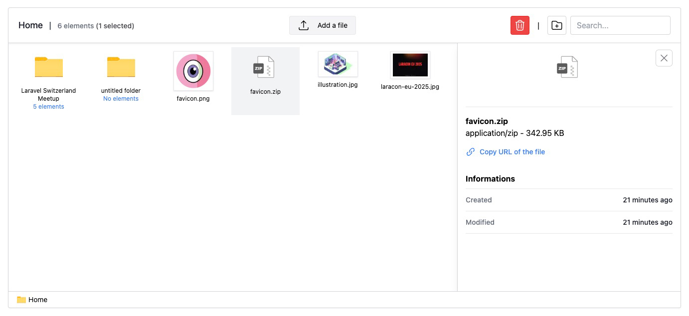

<p align="center">
    <picture>
        <source media="(prefers-color-scheme: dark)" srcset="./images/banner_dark.png">
        <source media="(prefers-color-scheme: light)" srcset="./images/banner_light.png">
        
    </picture>
</p>

# Livewire Filemanager

A simple, friendly, and practical file manager designed specifically for Laravel applications. This Livewire-powered tool makes it easy to manage files and folders within your project, offering an intuitive interface and seamless integration with Laravel's ecosystem. Perfect for developers seeking an efficient and user-friendly solution for file and folders management.

- Drag & drop files
- Search for files or folders
- Ready to include in any projects
- Multiple languages (see resources/lang for the list)
- Darkmode available

Watch the presentation of the package here: [Laravel Switzerland Meetup](https://www.youtube.com/watch?v=lgk_1AtukfM)

## Project requirements

- PHP 8.2.0 or greater required

## Important composer dependencies

- [livewire/livewire](livewire.laravel.com)
- [spatie/laravel-medialibrary](https://spatie.be/docs/laravel-medialibrary)

## Installation

> [!IMPORTANT]
> This package is still in development and its structure can change until a stable version is released. Use with caution in you projects.
> Additionally, the file manager does not include any security layers to protect uploaded documents. You are responsible for controlling access where you install the package and securing your files and folders.

You can install the package via [composer](https://getcomposer.org):

```bash
composer require livewire-filemanager/filemanager
```

Publish the package's migration file:

```bash
php artisan vendor:publish --tag=livewire-fileuploader-migrations
```

This package relies on spatie/medialibrary to handle the medias, so if you haven't already configured the package, don't forget this step:

```bash
php artisan vendor:publish --provider="Spatie\MediaLibrary\MediaLibraryServiceProvider" --tag="medialibrary-migrations"
```

If you need for informations about the spatie/medialibrary package, please [visit their documentation](https://spatie.be/docs/laravel-medialibrary)

> [!NOTE]
> **Thumbnails** When you upload images, the package will generate a thumbnail. By defaults, it will be dispatched into the queues. You'll have to launch the workers inside your app or change the **QUEUE_CONNECTION** value in your .env file

After that, you need to run migrations.

```bash
php artisan migrate
```

This will create a `folders` table which will hold all the filemanager structure and a media table if not already present.

### Package configuration

Next, you'll need to use the `<x-livewire-filemanager />` component where you want to place the filemanager.

For the styles and scripts, the package relies on TailwindCSS and AlpineJS. So if you don't already have them installed, you can include the `@filemanagerScripts` and `@filemanagerStyles`.

```html
<!DOCTYPE html>
<html>
<head>
    @filemanagerStyles
</head>

<body>
    <x-livewire-filemanager />

    @filemanagerScripts
</body>
</html>
```

> [!IMPORTANT]
> The @filemanagerStyles will include the PLAY CDN from TailwindCSS which is not recommended for production. Instead, prefer including the path inside your tailwind config file.

Tailwind version 4, in your app.css
```js
@source '../../vendor/livewire-filemanager/filemanager/resources/views/**/*.blade.php';
```

Tailwind version 3, in your tailwind.config.js
```js
module.exports = {
    content: [
        './resources/**/*.blade.php',
        './vendor/livewire-filemanager/filemanager/resources/views/**/*.blade.php',
    ],
}
```

If you intend to give access to your files with the public, you can add this inside your web routes file:.

```
Route::get('{path}', [FileController::class, 'show'])->where('path', '.*')->name('assets.show');
```

And don't forget to import the FileController class:

```
use LivewireFilemanager\Filemanager\Http\Controllers\Files\FileController;
```

This will give you an endpoint where you can reach the files with a direct url.

Inside the filemanager, when you click on a file, you'll have the possibility to copy the url to the file. In order to work correctly, this feature needs to have your domain with https enabled.

## The interface

Once everything is installed, the interface should look like this:

<p align="center">
    <picture>
        <source media="(prefers-color-scheme: dark)" srcset="./images/interface-dark-mode.jpg">
        <source media="(prefers-color-scheme: light)" srcset="./images/interface-light-mode.jpg">
        
    </picture>
</p>

The whole interface is available in dark/light mode.

#### ACL Configuration
If you want to enable ACL, you should publish the config file:

```bash
php artisan vendor:publish --tag=livewire-fileuploader-config
```

This will create a `livewire-fileuploader.php` file inside your config folder. You can now enable the ACL by changing the `acl_enabled` value to `true`.

Also publish the Spatie medialibrary config file, if you haven't already done it.

```bash
php artisan vendor:publish --provider="Spatie\MediaLibrary\MediaLibraryServiceProvider" --tag="medialibrary-config"
```

In the media-library config file, change the `media_model` value to `LivewireFilemanager\Filemanager\Models\Media`. If you already have a media model, you can use the Trait `LivewireFilemanager\Filemanager\Traits\HasMediaOwner` inside your model.

This will ensure that only users who created files can view them.

## Testing

```bash
composer test
```

## Changelog

Please see [CHANGELOG](CHANGELOG.md) for more information on what has changed recently.

## Contributing

All contributions are welcome and will be fully credited.

Please see [CONTRIBUTING](CONTRIBUTING.md) for details.

## Credits

- [Yves Engetschwiler](https://github.com/bee-interactive)
- All illustrations are made by [Quetzal Graphic Design](https://quetzal.ch/)
- [All Contributors](../../contributors)

## License

The MIT License (MIT). Please see [License File](LICENSE.md) for more information.
